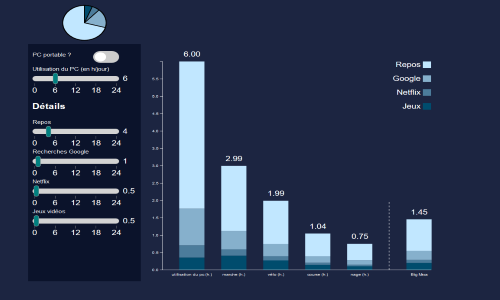

# Project : Power-consumption-analogy
Today, the question of our impact on the environment is crucial. But people aren't familiar to take in consideration their web and computer using habits into the frame of their electrical impact. It is difficult to represent us our electricity consumption, because of our abstract representation of the Watt/Hour unit.

Our goal with this project is to raise awareness among people about the electric cost induced by their own computer usages. We're proposing to highlight theses costs with familiar concepts for non expert peoples, with concrete scales (ex: physical efforts, number of Big-Mac in kilo-calories, etc.).

	

This project is realised within the scope of the Data Vizualisation course of Lyon 1 University M2 IA :
https://lyondataviz.github.io/teaching/lyon1-m2/2019/

## Project pages
https://github.com/JBGUIMBAUD/pc_energy_cost

## Visualisation
https://jbguimbaud.github.io/Power-consumption-analogy/

## Schedule
https://github.com/JBGUIMBAUD/pc_energy_cost/wiki/Planning

## Guidance document
https://github.com/JBGUIMBAUD/pc_energy_cost/wiki/Document-de-cadrage

## Students
* Jean-Baptiste Guimbaud 11408925
* Nicolas Condomitti 11708681
* Théo Buttez 11506528
* Jérémy Duval 11501022

## Teachers
* [Aurélien Tabard](http://tabard.fr/)
* [Romain Vuillemot](http://romain.vuillemot.net/)

___

# Projet : Power-consumption-analogy
Aujourd'hui, la question de notre impact energétique sur l'environnement est une question centrale. Cependant, le grand publique ne semble pas habitué à relier leur utilisation d'internet et des ordinateurs et leur consommation électrique. Cela est dû notamment au fait qu'il est compliqué de se représenter les Watt/Heure de manière concrète.

Notre but est donc de sensibiliser le grand publique au coût énergétique induit par sa propre utilisation de l'ordinateur. Nous proposons de mettre ces coûts en évidence en les traduisant en divers concepts familiers à une personne non experte, par l'utilisation de "concrete scales" (ex : effort physique, nombre de Big-Mac en terme de calories, etc.).

	

Ce projet est réalisé dans le cadre du cours de Data Vizualisation du M2 IA de l'université Lyon 1 :
https://lyondataviz.github.io/teaching/lyon1-m2/2019/

## Page du projet
https://github.com/JBGUIMBAUD/pc_energy_cost

## Page de la visualisation
https://jbguimbaud.github.io/Power-consumption-analogy/

## Planning
https://github.com/JBGUIMBAUD/pc_energy_cost/wiki/Planning

## Document de cadrage
https://github.com/JBGUIMBAUD/pc_energy_cost/wiki/Document-de-cadrage

## Etudiants
* Jean-Baptiste Guimbaud 11408925
* Nicolas Condomitti 11708681
* Théo Buttez 11506528
* Jérémy Duval 11501022

## Enseignants
* [Aurélien Tabard](http://tabard.fr/)
* [Romain Vuillemot](http://romain.vuillemot.net/)
